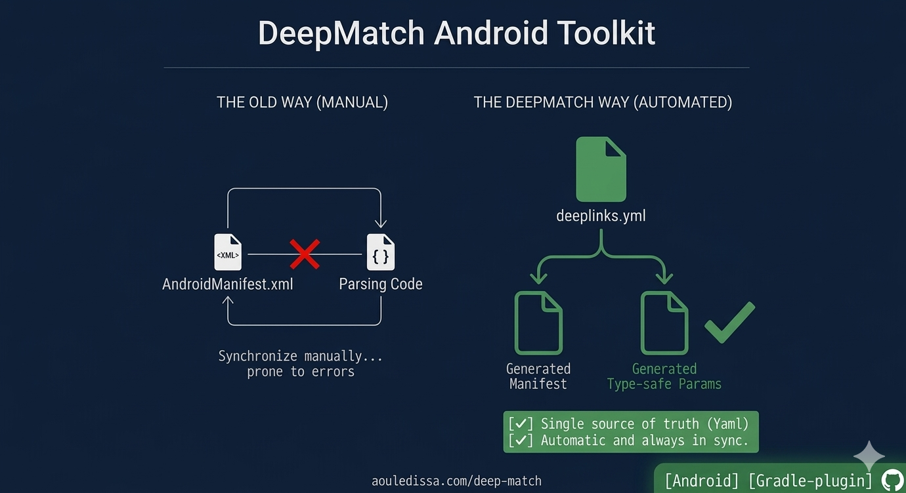
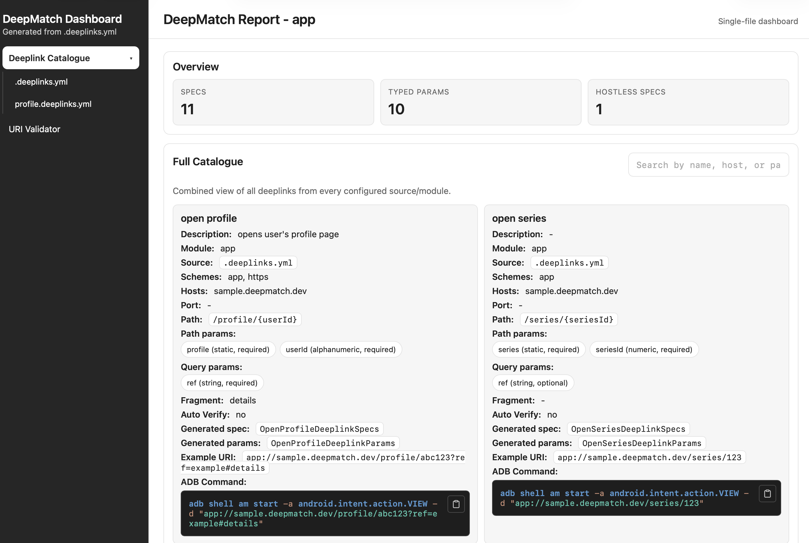
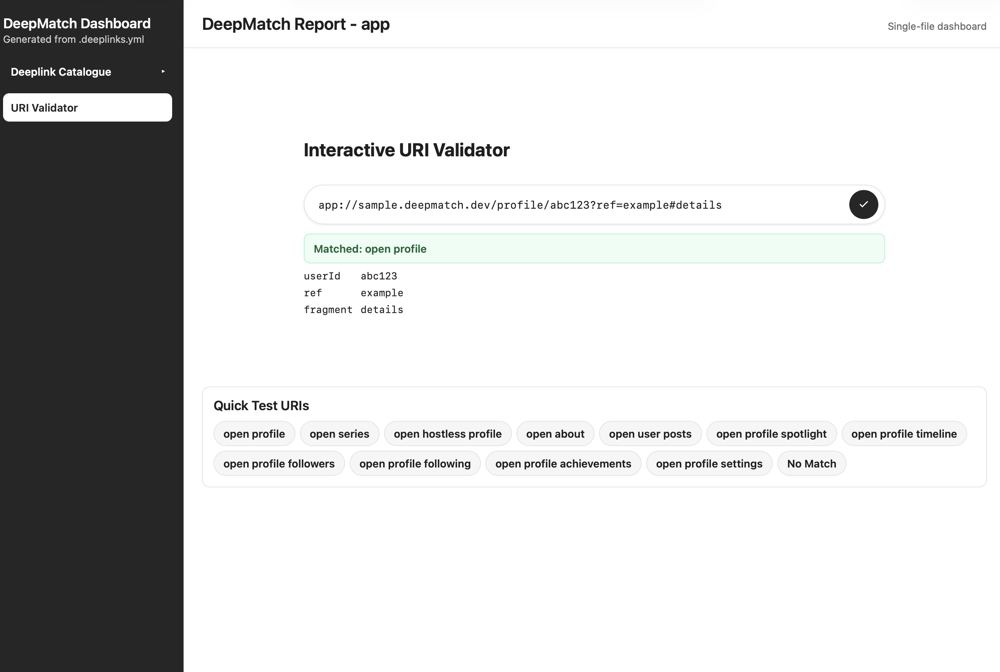

> **Security notice:** The primary artifact signing key has been compromised and revoked
> (`5283 67B0 1C0B 54E0 55A6  96E0 4D0B DAAD C6F8 86DB`). Do not trust it.
> All releases from 1.1.0 onwards are signed with the new key
> (`80D0 DA79 427D A034 593F  2F35 0F14 8D47 0842 C013`).
> See [CHANGELOG](CHANGELOG.md#110---2026-03-29) for details.


[](https://aouledissa.com/deep-match/)
[](https://github.com/aouledissa/deep-match/releases)
[](https://plugins.gradle.org/plugin/com.aouledissa.deepmatch.gradle)


[](https://www.apache.org/licenses/LICENSE-2.0)
[](https://androidweekly.net/issues/issue-717)

# DeepMatch — Android Deeplink Toolkit

DeepMatch is a complete toolkit for Android deeplink handling: a Gradle plugin and runtime library that automates everything. Describe your links once in YAML, and it generates the manifest intent filters, type-safe parameter classes, and runtime routing logic for you.



## Why DeepMatch?

Android deep linking has a fundamental synchronization problem. Every deep link must be declared in at least two places: the `AndroidManifest.xml` as an `<intent-filter>`, and your Kotlin code as string-based URI parsing logic. When one changes without the other, links break silently at runtime.

**DeepMatch eliminates this entirely.** You declare your deep links once in a YAML spec file. The Gradle plugin reads that file and automatically generates:

- `<intent-filter>` entries in your `AndroidManifest.xml`
- Strongly-typed Kotlin parameter classes (one per deep link)
- A ready-to-use runtime processor for URI matching

The YAML file becomes the single source of truth for everything deep link-related.

## Key Features

**Automatic manifest generation** — The plugin generates all `<intent-filter>` entries for you. It picks the right path attribute (`path`, `pathPrefix`, `pathPattern`), correctly handles mixed schemes for App Links verification, generates separate intent filters for each host and scheme combination for granular routing control, and suppresses AGP 9 lint warnings for hostless URIs. You never touch the manifest XML for deep links again.

**Type-safe routing** — Instead of extracting strings from a `Uri` and casting manually, you get generated data classes with typed fields. A `numeric` path param becomes an `Int`. A missing optional query param becomes `null`. A successful match is never ambiguous with no-match.

**Build-time validation** — The plugin catches broken configurations before they ship: missing schemes, duplicate spec names, and URI-shape collisions across composed modules all fail the build with a clear error.

**Multi-module composition** — Library modules declare their own `.deeplinks.yml`. App modules automatically discover and compose all dependency processors into a single unified `CompositeDeeplinkProcessor`. Collision detection runs at build time.

**URI validation task** — Run `./gradlew validateDeeplinks --uri "..."` to test any URI against your specs locally and get a per-spec `[MATCH]` / `[MISS]` diagnostic with extracted params.

**HTML report** — Optionally generate a self-contained HTML deeplink catalog with a live in-browser URI validator, auto-generated example URIs, and near-miss diagnostics.

## Setup

### 1. Apply the plugin

```kotlin
// app/build.gradle.kts
plugins {
    id("com.android.application")
    // AGP 9+: Kotlin is built into AGP, do not apply org.jetbrains.kotlin.android
    id("com.aouledissa.deepmatch.gradle") version "<version>"
}
```

### 2. Add the runtime dependency

```kotlin
dependencies {
    implementation("com.aouledissa.deepmatch:deepmatch-processor:<version>")
}
```

### 3. Create a spec file

Create `.deeplinks.yml` in your module root:

```yaml
deeplinkSpecs:
  - name: "open profile"
    activity: com.example.app.ProfileActivity
    categories: [DEFAULT, BROWSABLE]
    scheme: [https, app]
    host: ["example.com"]
    pathParams:
      - name: profile
      - name: userId
        type: alphanumeric
    queryParams:
      - name: ref
        type: string
        required: true
    fragment: "details"

  - name: "open series"
    activity: com.example.app.MainActivity
    categories: [DEFAULT, BROWSABLE]
    scheme: [app]
    host: ["example.com"]
    pathParams:
      - name: series
      - name: seriesId
        type: numeric
    queryParams:
      - name: ref
        type: string
```

**Path params** are matched positionally and in order. **Query params** are matched by name, order-independent. Untyped params act as literal path segments. Host is optional — omit it for hostless URIs like `app:///home`.

### 4. Build

```bash
./gradlew build
```

The plugin generates intent filters in your manifest, a typed `AppDeeplinkParams` sealed interface, one `*DeeplinkParams` class per spec, and an `AppDeeplinkProcessor` ready for use at runtime.

### 5. Handle deep links

```kotlin
class MainActivity : AppCompatActivity() {

    override fun onCreate(savedInstanceState: Bundle?) {
        super.onCreate(savedInstanceState)

        when (val params = AppDeeplinkProcessor.match(intent.data) as? AppDeeplinkParams) {
            is OpenProfileDeeplinkParams -> openProfile(params.userId, params.ref)
            is OpenSeriesDeeplinkParams  -> openSeries(params.seriesId)
            null -> showHome()
        }
    }
}
```

No string extraction. No manual casting. No runtime surprises.

## Configuration

```kotlin
deepMatch {
    generateManifestFiles = true                          // default: false
    manifestSyncViolation = ManifestSyncViolation.WARN    // default: WARN — use FAIL to break the build
    verbose = true                                        // default: false — set to true to enable build logs
    report {
        enabled = true             // default: false
        // output = layout.buildDirectory.file("reports/deeplinks.html")
    }
}
```

## Deeplink Report

Enable the report to generate a self-contained HTML dashboard for viewing, testing, and sharing your deeplinks:

### Deeplink Catalogue

Browse all your deep links in a searchable, organized catalogue with full spec details:



The catalogue displays:
- Spec name, description, and module/source
- Schemes, hosts, ports, and path templates
- Path and query parameters with types and requirements
- Example URIs with sample values
- **ADB commands for terminal testing** — Copy-to-clipboard commands to quickly test deeplinks using `adb shell am start`
- Generated Kotlin class names and regex patterns

### Interactive URI Validator

Test any URI against your specs in the browser with live validation and near-miss diagnostics:



The validator shows:
- Matching spec with extracted parameters
- Near-miss diagnostics (e.g., missing required query params)
- Quick-test buttons for each spec's example URI
- Full URI parsing without leaving the browser

The report is a single self-contained HTML file — no external dependencies, no server required. Share it via email, upload as a CI artifact, or host as a static page.

## Gradle Tasks

| Task | Description |
|------|-------------|
| `generate<Variant>DeeplinkSpecs` | Generate Kotlin sources from YAML specs |
| `generate<Variant>DeeplinkManifest` | Generate manifest intent filter entries |
| `generate<Variant>DeeplinkReport` | Generate the HTML deeplink report (if enabled) |
| `validateDeeplinks --uri "..."` | Validate a URI against all declared specs |
| `validate<Variant>CompositeSpecsCollisions` | Detect URI-shape collisions across composed modules |

Required query params generate non-null properties. Optional query params generate nullable ones.

## Multi-Module Projects

Each module declares its own `.deeplinks.yml`. The plugin auto-discovers any Gradle dependency that also applies DeepMatch and composes all their processors into a `CompositeDeeplinkProcessor` in the consuming app. The first processor in dependency order that matches a URI wins.

```kotlin
// No manual wiring needed. This is generated automatically.
val result = AppDeeplinkProcessor.match(uri)  // Searches all composed modules
```

Collision detection across composed modules runs as part of the build.

## Modules

| Module | Description |
|--------|-------------|
| `deepmatch-plugin` | Gradle plugin that parses YAML specs, generates Kotlin sources, and produces manifest entries |
| `deepmatch-processor` | Android library with `DeeplinkProcessor` and `CompositeDeeplinkProcessor` for runtime URI matching |
| `deepmatch-api` | Shared model classes: `DeeplinkSpec`, `Param`, `ParamType`, `DeeplinkParams` |
| `deepmatch-testing` | Reusable test fixtures: fake processors and spec builders |
| `samples/android-app` | End-to-end sample with Compose UI, generated manifest, and ADB test URIs |

## Documentation

Full documentation is available at **[aouledissa.com/deep-match](https://aouledissa.com/deep-match/)**.

| Page                                                         | Description                                                |
|--------------------------------------------------------------|------------------------------------------------------------|
| [Plugin](docs/plugin.md)                                     | Plugin setup, configuration, and build integration         |
| [Deeplink Specs](docs/deeplink-specs.md)                     | Full YAML spec reference with examples                     |
| [Composite Specs](docs/composite-specs.md)                   | Multi-module processor composition and match precedence    |
| [Tasks](docs/tasks.md)                                       | All generated Gradle tasks and the `validateDeeplinks` CLI |
| [Report](docs/report.md)                                     | HTML catalog and live URI validator                        |
| [Migration 0.3.0-beta](docs/migrations/migration-guide-0.3.0-beta.md)   | Migration guide for 0.3.0-beta                             |
| [Migration 0.2.0-alpha](docs/migrations/migration-guide-0.2.0-alpha.md) | Migration guide for 0.2.0-alpha                            |

## Testing

```bash
./gradlew test                  # Run all unit and Robolectric tests
./gradlew publishToMavenLocal   # Publish locally for downstream testing
```

Shared test fixtures live in `deepmatch-testing` and can be used in downstream projects.

## Official Distribution

Official DeepMatch releases are published **exclusively** to [Sonatype Central Portal (Maven Central)](https://central.sonatype.com/namespace/com.aouledissa.deepmatch) for library artifacts and the [Gradle Plugin Portal](https://plugins.gradle.org/plugin/com.aouledissa.deepmatch.gradle) for the plugin. **The authors bear no responsibility for artifacts obtained from any other source.** See [SECURITY.md](SECURITY.md) for the full policy.

## Contributing

Issues and pull requests are welcome. Please ensure `./gradlew test` passes before opening a PR.

## License

```
Copyright 2026 DeepMatch Contributors

Licensed under the Apache License, Version 2.0 (the "License");
you may not use this file except in compliance with the License.
You may obtain a copy of the License at

    http://www.apache.org/licenses/LICENSE-2.0

Unless required by applicable law or agreed to in writing, software
distributed under the License is distributed on an "AS IS" BASIS,
WITHOUT WARRANTIES OR CONDITIONS OF ANY KIND, either express or implied.
See the License for the specific language governing permissions and
limitations under the License.
```
